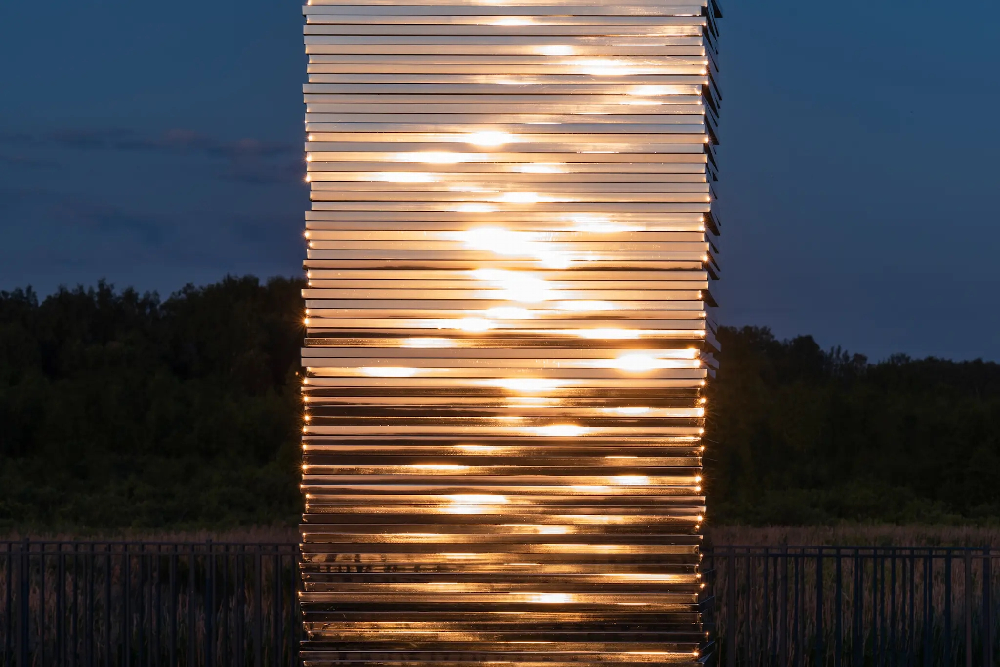

 

 

.jpeg)

.jpeg)

***Talmud***

*Design: Gregory Orekhov*

*Project Location: Senezh Lake, Moscow Region, Russia*

*Typology: Installation*

*Built: 2023*

*Material: Mirror-polished stainless steel*

*Photo credits: © Nikita Subbotin, Konstantin Antipin*

 

 

**一周是一年的2%**

​    *- 2024年度语录*

​    *- 2024年度文章、书籍*

​    *- 2024年度朋友*

 

 

## **2024年度语录**

> 取之不尽的能源对于AI的重要性不言而喻，我现在大部分时间都在思考，如何能构建足够的AI算力，这最终归结为芯片和能源。

——Sam Altman

 

 

 

 

> 有勇气不追随任何人的教条，有智慧知道别人说的一些话一定是对的。

——Sean McClure

 

 

 

 

> 过去十年，英伟达将深度学习的计算成本降低了100万倍，“能够通过人类测试”的AGI最快将在五年内到来，以及计算的能力将继续提升，在未来十年中提高100万倍。

——黄仁勋

 

 

 

 

> 16世纪，奥斯曼帝国禁止使用印刷机，导致此后300年都落后于西方。如果我们对 AI 过度监管，后果可能就像禁止印刷机。

——Omar Sultan Al Olama

 

 

 

 

> 如果你没有时间集中精力学习新知识，那么就花时间复习已经学过的内容。

——Hacker News 读者

 

 

 

 

> 我们消费的信息和我们摄入的食物一样重要。它影响着我们的思想，我们的行为，我们如何理解自己在世界上的位置，以及我们如何理解他人 

——Evan Williams

 

 

 

 

## **2024年度文章、书籍**

[**写于2021**](https://para.bearblog.dev/2021/)

[**信息流沙**](https://www.yuque.com/ppip/info/zqno44)

**《伟大的博弈》**

**《阅读、游历和爱情》**

**《不受掌控》**

**《Life after Capitalism：The Meaning of Wealth, the Future of the Economy, and the Time Theory of Money》**

 

 

 

 

## **2024年度朋友**

**Patrick Collison**

1. 没有人会教你如何思考。你要形成自己的世界观。
2. 多读书，尤其是多读历史，早期的人对未来的设想有时比现实的结果更好，从中能获得更多想象力。
3. 找到你感兴趣的领域中的优秀的人，和他们成为朋友，网友也可以。
4. 不光要说，也要写—-因为演讲是一次性的，听众越多越无趣，而且随着传播变得更加不严谨；但写作可以穿越时间、重复阅读、不断更新，并且更加完整、更加清晰、更加严谨
5. 你不应该跟随你欣赏的人，而是跟随他们欣赏的人。所以我试着搞明白我欣赏的人是怎么成为他们现在这样的？他们的上游是什么？

 

 

 

 

**硅谷王川**

1. 任何无法指数增长的事业，很容易成为时间和精力的泥潭，有机会一定要立刻逃离。
2. 财富的迁移往往是看不见的，突然的跃迁。随时准备抛弃过去，跃迁到能量和信息效率更高的系统上。
3. 财富总是流向更高级的一对多的技术。
4. 最大的财富是闲暇时间，对闲暇时间的最大杀手是一对一的交流，给一个老板打工，或者做一次只能卖给一个客户的定制服务。
5. 人为什么会卡在一个没有增长前途的方向里? 很大原因是缺乏对外自由连接和自由贸易的基础设施。
6. 躺平者是那些选择不主动去拼搏、而是静观其变的人。他们关注的是社会中各种能量（如金钱、人才等）的流动趋势，寻找最佳的机会点来捕捉这些能量。

 

 

 

 

**George Gilder**

“信息宇宙十二法则”和“信息时代繁荣经济的十个要点和禁忌” 《资本主义之后的生活》封神之作，整个人都被脱胎换骨。这本书的历史研究背景考察之多，无与伦比。

 

 

 

 

**许哲**

投资就是占据尽可能多的生产资料，不断有产出，才是财富不被稀释的唯一正途。

货币=债务的标记

我们转移、记录的是债务关系——>>契约关系——>>财富的激励机制——>>收益——>>覆盖债务, 核心是时间学习成本曲线的下降，带来的收益。

如果我们底层上明白 the waterworks of money就应该学聪明，庖丁解牛，王川说的躺平者是怎样的了。

拜读许哲的知乎专栏——天下不会掉馅饼，有感。