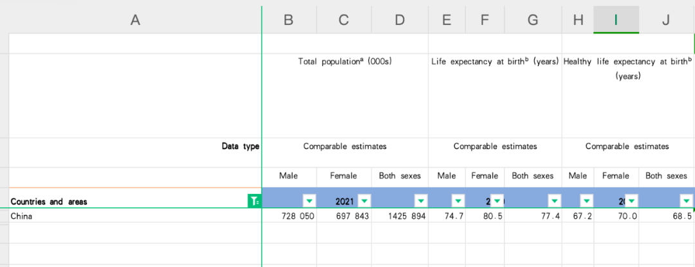

**一周是一年的2%**

一周是一年的2%，这句话从于阮一峰的周刊阅读到[2]。从此我也更新为这一条目，年初的[新十年](http://mp.weixin.qq.com/s?__biz=MzkzMjE3NTg5Ng==&mid=2247486343&idx=1&sn=03e7288480e890cb4523f96f062b2018&chksm=c25e82f0f5290be6db6e67132898fceb81473c59167edfe60f838eda5b39851b13401c717d16&scene=21#wechat_redirect)中的今年手册就给自己定下过目标试试每周写一篇。

我们总是感慨离开学校的之后的工作生活如此之快，这不我转眼大学毕业6年，在杭州、悉尼、北京，清迈兜转了一圈。

​    如果用年衡量，现代人类的平均寿命70-80年，这也算长寿了,健康的寿命就比较短了。

2023年的统计，从生命长度来说，中国男性的平均寿命74.7，女性80.5，而从健康角度来说，中国男性平均健康寿命67.2，女性70.0。[3]

麦肯锡的数据更加表明

“过去60年，全球人均预期寿命从54岁增长到73岁，即使是全球一些最不发达的地区，人均预期寿命仅过去20年也延长了10岁。中国的健康事业成就更是令人瞩目，人均预期寿命从1960年的44岁（低于全球平均10岁）增长到2019年的77岁（高于全球平均4岁，到2020年达到77.93岁，与美国相当）” [4]。

这些年的工作、学习，我都不善于给自己立目标，立期望，只是用一种冥冥中的感觉来指导自己，现在回过头想想，为什么没有突破也是有原因的。正如我之前所说人是善于遗忘的动物，记录、复盘才能建构自己，这样才能好好度过每一周，有方向就不至于虚度，即使某些时间是疲惫和迷失的，但是时常回头看看，还是知道路接下来怎么走的。

这在今年的手册8条中，我看了一下，可以说4条直接或间接都是和记录、复盘有关系。

幸福的三大要素是：有要做的事（something to do）、有要爱的人（someone to love）、有寄予希望的东西 （something to hope for)

——亚历山大 查莫斯 19世纪美国著名医生

与信息生活

这周的产品沉思录中，我发现了诺伯特·维纳（Norbert Wiener），于是顺着看了一他的一篇文章，他说

“人活着就不免要参加受到外界影响并对外界作出行动的连续流中，而在这个连续流中，我们只不过是承前启后的中介物而已。”[1]

“所谓有效地生活就是拥有足够的信息来生活。由此可知，通信和控制之作为个人内在生活的本质就跟它们之作为个人社会生活的本质一样。”[1]

对于信息，有信号和噪音，噪音始终是大于信号的，于是与它们相伴是不可避免的，我们才需要控制。所谓大隐隐于市，我想也是这个道理。

这里面的还有一句话印象深刻，

资讯永远不能取代启迪（Information will never replace illumination），”苏珊·桑塔格在考虑“文字的良心”（the conscience of words）时断言。[1]

研究其本质就是慢就是快，这是方法，很多人听不进去，包括我曾经，因为追求捷径是人性的本质。

王小波

王小波啊，王小波，在将来中国的每一个时代，我相信都有属于你的读者,和你共鸣，你乃真性情。开始又回看这些文字。

“但是在这世界上的一切人之中，我最希望予以提升的一个，就是我自己。这话很卑鄙，很自私，也很诚实。”[5]

“社会就相当于一个放大器，人首先有某种待满足的物欲，在欲望推动下采取的行动使欲望满足，得到了乐趣，这都是正常的。乐趣又产生欲望，又反馈回去成了再做这行动的动力，于是越来越凶，成了一种毛病。”[5]

“中国人在人际关系里找到了乐趣，我们认为这是自己的一大优点。因为有此优点，我们既不冷漠，又不自私，而且人与自然的关系和谐。”[5]

“假如此说是正确的，那么真正的幸福就是让人在社会的法理、公德约束下，自觉自愿地去生活；需要什么，就去争取什么；需要满足之后，就让大家都得会儿消停。这当然需要所有的人都有点文化修养，有点独立思考的能力，并且对自己的生活负起责任来，同时对别人的事少起点哄。这当然不容易，但这是唯一的希望。看到人们在为物质自激，就放出人际关系的自激去干扰；看到人在人际关系里自激，就放出物质方面的自激去干扰；这样激来扰去，听上去就不是个道理”[5]

“我认为低智、偏执、思想贫乏是最大的邪恶。按这个标准，别人说我最善良，就是我最邪恶时；别人说我最邪恶，就是我最善良时。当然我不想把这个标准推荐给别人，但我认为，聪明、达观、多知的人，比之别样的人更堪信任。基于这种信念，我认为我们国家在“废黜百家，独尊儒术”之后，就丧失了很多机会”[6]

“我虽然已活到了不惑之年，但还常常为一件事感到疑惑：为什么有很多人总是这样地仇恨新奇，仇恨有趣。古人曾说：天不生仲尼，万古长如夜。但我有相反的想法。假设历史上曾有一位大智者，一下发现了一切新奇、一切有趣，发现了终极真理，根绝了一切发现的可能性，我就情愿到该智者以前的年代去生活。这是因为，假如这种终极真理已经被发现，人类所能做的事就只剩下了依据这种真理来做价值判断。从汉代以后到近代，中国人就是这么生活的。我对这样的生活一点都不喜欢。”[6]

投资界查理 芒格

火星界马斯克

写字界王小波

参考：

1.《人有人的用处》：控制论先驱诺伯特·维纳（Norbert Wiener）谈通信，控制和我们机器的道德

https://zhuanlan.zhihu.com/p/97209879

2.科技爱好者周刊（第 293 期）：一周是一年2% 
https://www.ruanyifeng.com/blog/2024/03/weekly-issue-293.html

3.World health statistics 2023: monitoring health for the SDGs, sustainable development goals 
https://www.who.int/publications/i/item/9789240074323

4.给生命以长度，给岁月以活力https://www.mckinsey.com.cn/%E7%BB%99%E7%94%9F%E5%91%BD%E4%BB%A5%E9%95%BF%E5%BA%A6%EF%BC%8C%E7%BB%99%E5%B2%81%E6%9C%88%E4%BB%A5%E6%B4%BB%E5%8A%9B/

5.“《东西方快乐观之我见》1995年第2期《东方》杂志”

6.“《思维的乐趣》载于1994年第9期《读书》杂志。”