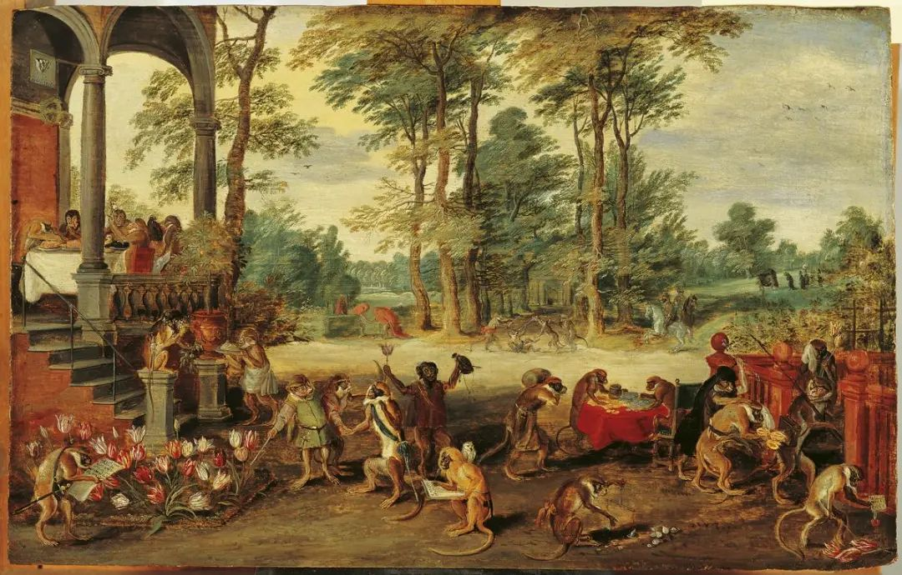

最近让我想起乔布斯生前的一段话

*Life can be much broader once you discover one simple fact—and that is: everything around you that you call life was made up by people that were no smarter than you. - Steve Jobs*

一旦你发现一个简单的事实，生活可以变得更加广阔——那就是：你所称之为生活的一切都是由并不比你聪明的人创造出来的。- 史蒂夫·乔布斯

乔布斯是在为我们去魅，这种没有裹挟的观点，让我觉得纯粹。

应该为这个世界去魅，但不是为了走向癫狂，而是为了回到自己身上。