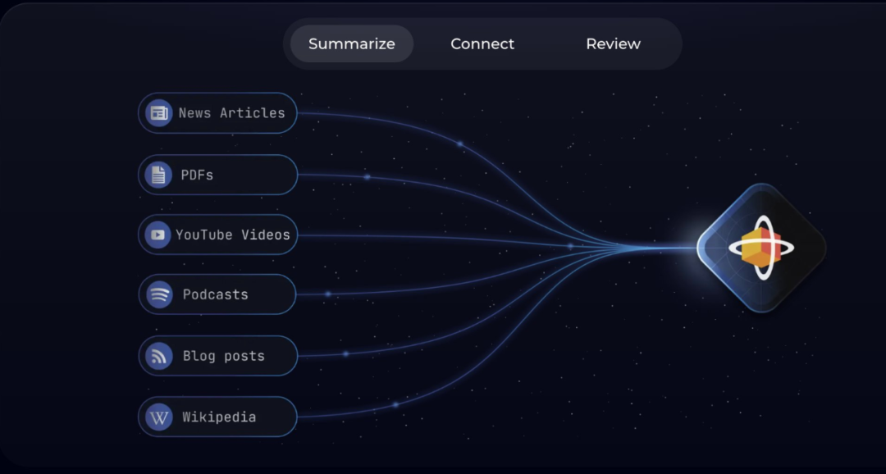
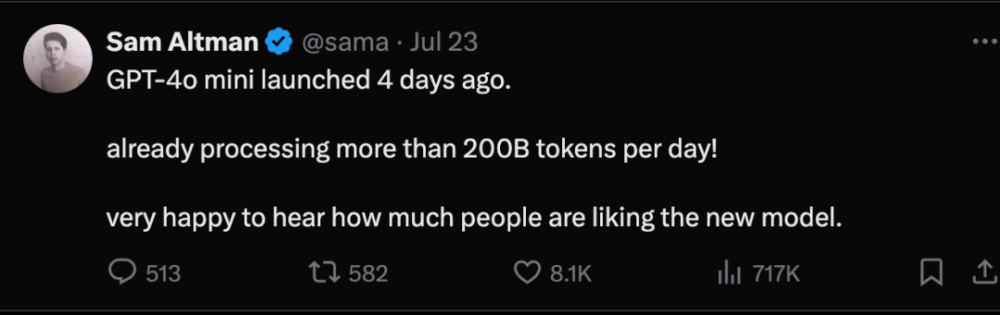
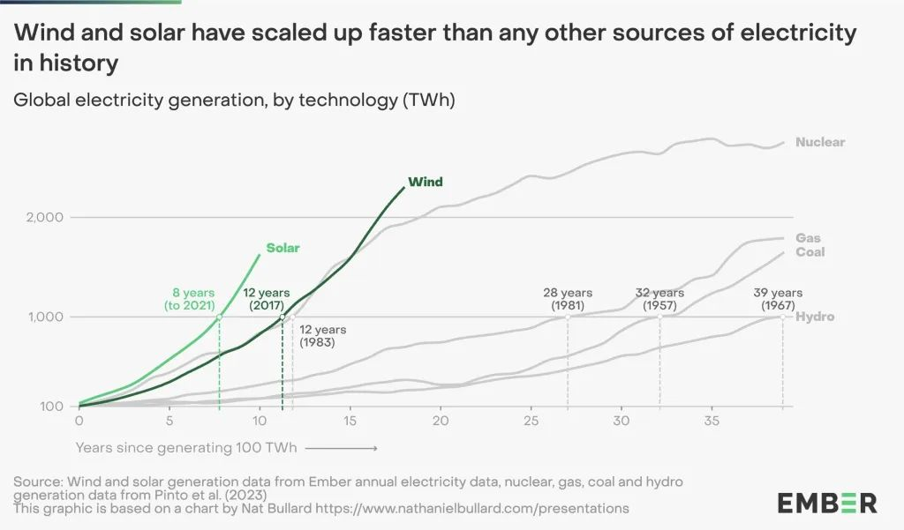
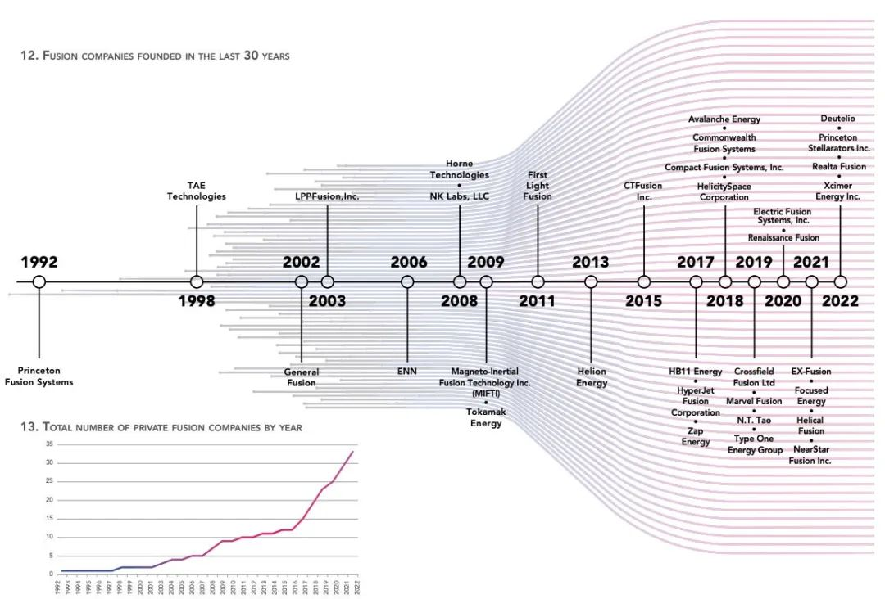

### 上一个流量时代2014-2023

#### 4g牌照发放

2013年12月4日，工业和信息化部向中国移动通信集团公司、中国电信集团公司和中国联合网络通信集团有限公司颁发“LTE/第四代数字蜂窝移动通信业务（TD-LTE）”经营许可。

正式商用为 2014 年下半年。

2015年 2 月 27 日工信部向电信以及联通颁发 FDD-LTE 牌照。

2018 年 4 月 3 日，工信部向移动颁发 FDD-LTE 牌照，中国 4G 网络商用相对其他国家晚约 3年时间。

#### 4g基站

中国移动2015年已建成全球规模最大、网络质量优秀的4G网络。4G 基站总量约110万个，实现了乡镇以上的连续覆盖，农村 数据热点的有效覆盖，基本实现了高铁、地铁、重点景 区的全面覆盖，覆盖人口超过12亿，城市道路平均下载 速率超过37Mbps。【2015年中国移动财报】

#### 4g手机渗透

在 2014 年正式商用后，4G 手机市场份额从 2014 年一季度的 7.4%快速增长。
到 2015 年一季度末，4G 手机渗透率已经达到80%，3G手机同时期市场份额急速下跌至6.6%。渗透率从0%-80%仅仅花费 15 个月。
2017 年 1 月，国内 4G 手机渗透率为 96%，由 80%-96%花费 22 个月。


#### 收入

2015年中国移动4G进入爆发式增长阶段，4G客户DOU（每个客户月均流量消费额）达748MB，移动数据流 量较上年增长143.7%，手机上网客户DOU较上年增长 118.5%，无线上网收入较上年增长30.5%，为人民币 2,009亿元。数据业务收入规模首次超过语音业务，占通信服务收入比达到52.0%。【2015年中国移动财报】

（已经变天，最大通信运营提供商的收入端发生了根本变化。）

4G客户快速 增长，全年净增2.22亿户，4G客户总数超过3.12亿户【2015年中国移动财报】


#### 二级助推剂—5个G的重力加速

2019年10月31日，中国移动、联通、电信三大运营商正式公布5G套餐。
2020年12月，累计建设开通5G基站超70万个，终端连接数超过1.8亿，5G手机累计出货量超过1亿部。
截至2023年底，我国累计建成5G基站337.7万个，5G移动电话用户达8.05亿户。

(最大作用的是其实是4g的普及和渗透，5g只是体验更好了，而4g真的带来全新的体验。）


### 抖音的出现

2014年10月musical.ly正式上线，这种fashion的音乐短视频产品在西方引爆。

2015年7月7日musical.ly在美国登顶AppStore榜首

2016年9月，抖音版本1.0.0上线。

2017年3月岳云鹏转发抖音视频被视为抖音“曝光”第一声枪响。

在上线17个月之后，抖音DAU突破1亿。

在2016年抖音发布的时候，在2015年已经有足够的基站、4g手机渗透支撑它的并行、爆发。回头去看2015年是一个关键的年份，因为基础已经到位，新的流动性需求需要诞生了。

### 流量

2015年到2018年，中国移动DOU（人均月流量消费量）从347M提升至3686M，增长超过10倍。


### AI Token时代

谷歌在2023年每天处理请求35亿次，全球10个人中有几乎有9个人使用谷歌搜索访问互联网。信息检索是互联网的基本功能，且需要无门槛访问。

AI的成本是一个硬伤，search的文字功能虽然免费，但最好的大模型的基础summary-read都不免费，且不说写代码、文生成图、视频等不免费，整体来说AI智能的summary-read就这一项普及化离10亿、20亿人的免费还差很远很远。



没有信息检索的免费，怎么有互联网？summary-read是信息爆炸后的自然演进，也会遵循免费使用。

AI 带来的体验也会是全新的，和当初的information在anytime、anywhere、anydevice的激活一样。AI开启intelligence在anytime、anywhere、anydevice对话。

上个10年在用流量计算，接下来的10年，按AI 的token计算。




而这一场AI的“4G时刻”是什么？不过肉眼可知的是限制AI的是算力，算力又来自于芯片、能源。







```
参考：
```

*1.“虎口夺食”全球下载量突破20亿次，抖音一路狂奔的“发家史” https://www.cyzone.cn/article/580079.html*

*2.**分析| 抖音“称霸”互联网，“重估”短视频正当时* *https://news.hexun.com/2021-08-27/204255188.html*

*3. 从 3G、4G 商用时间与终端渗透率看 5G 进展——电子行业周报（20181117）https://pdf.dfcfw.com/pdf/H3_AP201811191247899771_1.pdf*

*4. 工业和信息化部解读4G牌照发放 https://wap.miit.gov.cn/zwgk/zcjd/art/2020/art_9199f2223ad54b43aefa2d7c3467fde0.html*

*5. 中国全面进入4G时代 https://www.cac.gov.cn/2015-02/28/c_1114461752.htm*

*6. 从时间轴说起，分析抖音发展的3个阶段 https://www.woshipm.com/evaluating/994454.html*

*7.中国到底有多少基站，每年消耗多少流量？ https://36kr.com/p/1725207658497*

*8. 三大运营商2015年日赚3.8亿 合计共赚约1391亿http://www.xinhuanet.com/politics/2016-03/24/c_128828796.htm*

*9. \*Nvidia Shipped 3.76 Million Data-center GPUs in 2023, According to Study https://www.hpcwire.com/2024/06/10/nvidia-shipped-3-76-million-data-center-gpus-in-2023-according-to-study/**

*10.* **我国5G基站总数超337万个（新数据 新看点）****5G移动电话用户达8.05亿户**

**http://paper.people.com.cn/rmrb/html/2024-02/18***/nw.D110000renmrb_20240218_8-01.htm*

*11. 30+ Google Search Engine Statistics & Trends [2024 Update] https://www.websiterating.com/blog/research/google-search-engine-statistics/*

*12. 开通基站超70万个，这个“G”给你我带来什么——5G商用一年盘点 https://www.gov.cn/xinwen/2020-12/16/content_5569769.htm*

*13. 贫穷限制AI想象？｜ 硅谷徐老师对话英伟达、DeepMind专家ttps://www.xiaoyuzhoufm.com/episode/64dea6f74e968615a5202dd8*