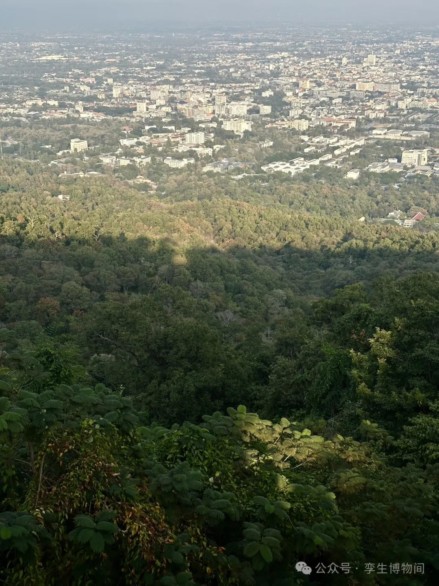

*饮食男女，人之大欲存焉。死亡贫苦，人之大恶存焉。故欲恶者，心之大端也。人藏其心，不可测度也，美恶皆在其心，不见其色也。*

在清迈最近送走了一些人了之后，我回到了自己身上，思考新的十年，思考接下来想要的生活，我一定不会想到，十年后当我回忆从北京离开的决定，对我的未来有多大影响。

思考和我重要的人将会一起发生的事情，当我承认，人生是非线性的时候，那些即将发生的事情，还有一定会发生的事情，我也就有了一个心态迎接它。

年轻人动手能力强，而哪些一旦被生活弄的忙忙碌碌的人，就不会去相信，生活依然还有可能，而就以下求

饮食男女，欲

死亡贫苦，恶

 在这里一年的日子即将结束，在去年回到自己的小时候的文字，明白自己的个人神话原来一直在那里，是我不自知后，那我想要的变得清晰了。

上周之前的发烧和昨天的摔伤，让我想到这些和锻炼没有关系，和是否有能力避免也没有关系，而像那一刻“冥冥之中”发生了，概率可以降低而无法阻止发生。不如把所有新来的变化当作反脆弱的养料。

新十年的开始在于我理解了一部分的世界，我也理解了一部分的我。

**今年手册**

1. 比2023年多读书
2. 不停地要写啊，试试每周写一篇
3. 过滤多余的信息应该成为一种习惯
4. crypto多参与，不要不参与
5. AI多动手，多执行
6. 走两步回头看一步
7. 不带情绪地观察众生相，但是为了回归本相
8. 为自己创业